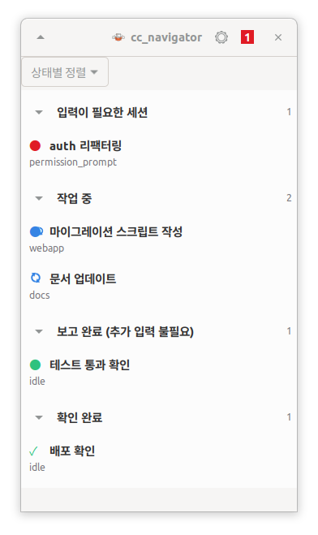
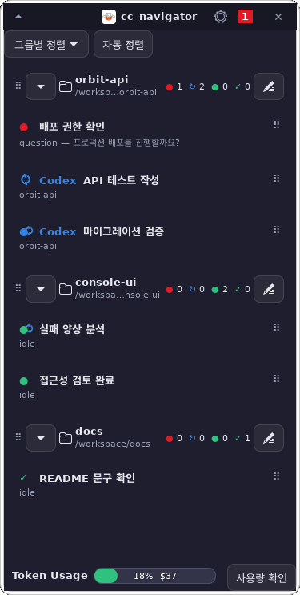

# cc_navigator

**English** · [한국어](README.ko.md)

> An always-on-top panel that lists every live Claude Code session, highlights the
> ones waiting for your input, and lets you **jump** to a session's terminal or
> **type a reply** straight into it — so you never hunt through a dozen windows to
> find which session a notification came from.

<p align="center">
  
</p>

> The panel's own UI is in Korean; this document describes it in English. See
> [한국어 README](README.ko.md) for the Korean version.

---

## Introduction

You run many Claude Code sessions at once, spread across many terminal windows.
When one needs input, a desktop notification fires — but it does not say *which*
session, and there is no way to reach that session except by hunting through
windows and tabs.

cc_navigator gives every session **one row, one status glyph, and one click to
get there**:

- **Status at a glance** — a red dot ● for a session waiting on your input, a
  green dot ● for one that finished its turn, and a spinning arrow ↻ while Claude
  is working. When a session has spawned subagents, a second spinner sits behind
  the main icon — so a session blocked on you (red) *while* its helpers keep
  running shows both at once. Click a green dot to mark it seen (a green check ✓). A
  badge in the title bar counts how many need input.
- **Two views** — sort by **status** (four collapsible sections: needs-input →
  working → reported → acknowledged) or by **project group** (one folder per
  working directory, with groups you can reorder).
- **Desktop nudge** — when a session becomes *your turn* — it starts waiting on
  your input, or finishes its turn — a desktop notification names that session,
  its status (🔴/🟢), and a one-line summary, so you need not watch the panel.
  On by default; toggle it off in Settings.
- **Jump** — click *"세션으로 이동"* to raise that session's terminal window.
- **Reply** — type one line into the row and press Enter to send it straight to
  the session's tmux pane.
- **Collapse & attach** — shrink the panel to its title bar, or dock it as a thin
  bar flush against a screen edge (and slide it along that edge).
- **Group management** — reorder sessions, move them between groups, rename groups,
  or re-group everything by directory with one button.

### How it works

Claude Code fires **hooks** on session lifecycle events. A tiny shim
(`bin/cc-navigator-hook`) records each event as a per-session state file. The panel
joins those state files against live `tmux` panes to decide what to show:

- **Liveness is derived, not announced.** A session that vanishes from `tmux`
  vanishes from the panel on the next tick and its state file is pruned, so a
  crashed session never leaves a ghost row.
- **Jump addresses the window by title.** `tmux`'s `set-titles-string` stamps
  `ccnav:<session>` onto the outer X11 window title; GNOME Shell activates the
  window carrying that title.
- **Reply injects one line** into the session's pane with `tmux send-keys -l`, so
  the text is delivered literally and never interpreted by a shell.

The guiding rule, which runs through every module and every test:

> **Never trust an API's self-report. Act through one channel, verify through
> another.** (`gdbus` exits `0` even when GNOME `Eval` did nothing, so the jump
> path acts through GNOME Shell `Eval` and *verifies* the effect through `xprop`.)

---

## Requirements

This is an **X11 + GNOME + tmux** tool, deliberately narrow. No third-party Python
dependencies — the standard library plus the system `gi` bindings only.

| | |
|---|---|
| Display server | **X11** (not Wayland) — focus is verified by reading `_NET_ACTIVE_WINDOW` via `xprop` |
| Desktop | **GNOME Shell with `Eval` unlocked** — blocked from GNOME 41 onward; developed on 3.36.9 |
| Terminal multiplexer | **tmux ≥ 3.0** — sessions are addressed by tmux pane |
| Interpreter | **`/usr/bin/python3` ≥ 3.8 with PyGObject** (`apt install python3-gi gir1.2-gtk-3.0`) |
| Also needed | `gdbus`, `xprop`, and `notify-send` (libnotify) for desktop notifications |

If GNOME `Eval` is unavailable **the app still runs** — the jump buttons are
disabled and the status bar explains why. Listing sessions and typing replies work
without it.

---

## Installation

```sh
git clone https://github.com/kodogyu/cc_navigator.git
cd cc_navigator

./run-tests                    # optional: expect "Ran 481 tests / OK"
./bin/cc-navigator-doctor      # checks your machine and prints exactly what to fix
```

**1. Run the doctor first.** It does not guess from a config file — it reproduces
the one tmux failure that matters (see the warning below) on a throwaway socket and
tells you precisely which lines to add to `~/.tmux.conf`.

**2. Put the launcher on your PATH** (optional but convenient):

```sh
./install        # symlinks bin/cc-navigator into ~/.local/bin (idempotent)
```

The `install` script only adds `cc-navigator` to your PATH. It deliberately does
**not** touch your Claude Code settings — hook wiring is a toggle inside the app
(step 4), so you can see and reverse it.

**3. Start the panel:**

```sh
cc-navigator &          # or ./bin/cc-navigator & if you skipped ./install
```

**4. Enable the Claude Code hooks — this is what makes sessions appear.** Open the
panel's **Settings** (the ⚙ gear button), and under **통합 (Integration)** turn on
**"Claude Code 훅 설정"**. That merges the hook shim into `~/.claude/settings.json`
for you (`SessionStart`, `UserPromptSubmit`, `Notification`, `Stop`, `SessionEnd`,
`PreToolUse`, `PostToolUse`, `SubagentStart`, `SubagentStop`). The same panel also offers toggles to
register cc_navigator in your app list (**"앱 목록에 등록"**) and start it on login
(**"로그인 시 자동 실행"**).

> **Upgrading?** Re-toggle **"Claude Code 훅 설정"** off and on — newer versions
> added `PostToolUse`, `SubagentStart`, and `SubagentStop`, which keep the spinner
> lit while Claude works and drive the subagent second icon. New hooks apply to
> sessions started afterward.

**5. Run one tmux session per project**, each attached in its own terminal window.
With no sessions registered the panel is inert — it makes **zero** tmux calls until
a hook writes the first state file.

<details>
<summary>Prefer to wire the hooks by hand?</summary>

Add the hooks in `wiring.RECOMMENDED_HOOKS` to `~/.claude/settings.json`, each
pointing at `<repo>/bin/cc-navigator-hook` by **absolute path**. The settings-dialog
toggle in step 4 does exactly this, so most people never need to.
</details>

### ⚠️ The tmux landmine the doctor exists to catch

On tmux 3.0a, a `~/.tmux.conf` line of the `set` family (`set`, `setw`,
`set-option`, `set-window-option`) whose flags include **none of `-g`, `-q`, `-s`**
silently corrupts the server at config-load time. The server then runs normally —
lists panes, switches windows — right up until something sends a **space** through
`send-keys`, at which point it **segfaults**, taking every Claude Code session
inside it with it. The trigger is the first reply you type that contains a space.

`bin/cc-navigator-doctor` detects this by loading your config into a throwaway
server and sending it a space, so you find out before cc_navigator ever touches
your real tmux. The fix is to add `-g`:

```diff
-set mode-keys vi
+setw -g mode-keys vi
```

---

## Usage

**Reading the list.** Each session is one row: a status glyph, its title, and (when
selected) its working directory and last prompt.

- 🔴 **red dot** — the session is waiting on you (a permission prompt, a question,
  a plan to approve). The title-bar badge counts these.
- 🟢 **green dot** — the session finished its turn and is idle. Click it to mark it
  seen (it becomes a green check ✓); click again to restore.
- ↻ **spinning arrow** — Claude is working.
- **two overlapping icons** — the session has subagents running: the main state in
  front, a subagent spinner behind. A working main with subagents shows a calm blue
  dot, so only the helper spins.

**Switch views** with the *"Sort by"* dropdown at the top:

- **상태별 정렬 (by status)** — four **collapsible** sections, in priority order:
  *입력이 필요한 세션* (needs input) → *작업 중* (working) → *보고 완료* (reported /
  idle) → *확인 완료* (acknowledged — the ones you clicked to a ✓). Collapse any
  section with its chevron.
- **그룹별 정렬 (by group)** — one folder per project directory, each with its own
  status counts (red ● → ↻ → green ● → ✓).

<p align="center">
  
</p>

**Act on a session.** Click a row to expand it:

- Type into the reply box and press **Enter** to send a line to that session.
- Click **"세션으로 이동"** to raise its terminal window (needs GNOME `Eval`).

**Arrange groups** (in group view): drag a **group header's ⠿ handle** (on the
left) to reorder whole groups; drag a row's **⠿ handle** (on the right) to reorder
it or drop it onto another group; click the **pencil** to rename a group; collapse
a group with its chevron; or press **"자동 정렬"** to re-group by directory and
restore the default order. Group order stays put as sessions come and go, and
switching sort views no longer moves the panel.

**Collapse & attach.** The chevron button (top-left) collapses the panel to its
title bar. **Long-press** it to open the attach picker — dock the panel as a thin
bar flush against any screen edge, showing just the icon, the input-needed count,
and a detach button. Docking uses the monitor's **work area**, so the bar sits
*beside* a system panel/dock that reserves edge space, not under it. While docked
you can **drag the bar along its edge**; the detach button restores the full panel.

**Settings** (the ⚙ gear) cover opacity, background colour, font size, screen
corner, keep-above / all-workspaces, **desktop notifications** (on by default),
a one-click self-update, and the **통합 (Integration)** toggles from the
installation steps above.

---

## Project layout

```
bin/
  cc-navigator            launcher — exec's the app, surfaces errors
  cc-navigator-hook       Claude Code hook shim — swallows everything, always exit 0
  cc-navigator-doctor     prerequisite checker
src/ccnav/
  paths.py       state directory (mode 0700)
  hookstate.py   hook event → (state, reason); pure
  statestore.py  atomic write / read_all / prune — the only filesystem owner
  hook.py        the shim's logic
  proc.py        the only subprocess call site; bounded by a timeout
  tmuxctl.py     tmux queries and actions
  gnome.py       activate a window by title, then prove it happened via xprop
  model.py       join state files with live tmux panes → rows; pure
  ui.py          the overlay window; formatting is pure functions above the widgets
  wiring.py      launcher / autostart / settings.json hook merge (the Integration toggles)
  updater.py     safe fast-forward self-update
  doctor.py      prerequisite checks, including the segfault reproduction
  app.py         wiring — nothing blocking ever runs on the GTK main thread
```

Design, plan, and a per-task engineering ledger live under [`docs/`](docs/) — start
with [`docs/superpowers/sdd/implementation-log.md`](docs/superpowers/sdd/implementation-log.md).

## Status

The full feature set is built and the suite is green (**481 tests**). Every task is
checked with **mutation testing** — the implementation is deliberately broken N ways
and every break must fail a named test — and the riskiest changes go through an
adversarial multi-agent review before landing.
